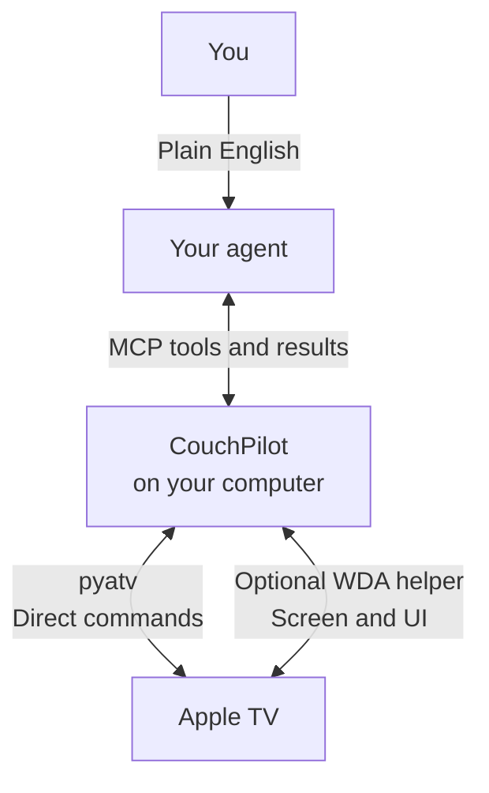

# 🛋️ CouchPilot

**Let your agent control your Apple TV.**

I got sick of screwing around with Apple TV settings, hunting down shows across streaming apps, and relaying an agent’s troubleshooting advice through the remote. CouchPilot lets you ask your agent in plain English to queue up shows, change settings, and navigate apps—especially useful with a projector, where fixing the picture can take longer than picking a movie.

> “Find Breaking Bad and get an episode ready.”
>
> “Help me fix the washed-out picture.”
>
> “Find and install Crossy Road.”

A local, open-source bridge for **Codex, Claude Code, and other MCP agents**. No jailbreak. No separate model API key.

## How it works

[pyatv](https://github.com/postlund/pyatv) handles power, playback, app launches, and typing over your local network. For tasks that need the screen, a signed [WebDriverAgent](https://github.com/appium/WebDriverAgent) helper on the Apple TV returns UI labels, focus, and screenshots. Your existing agent chooses the next action and checks the result, using compact text observations first and images when needed.

## Why CouchPilot?

I started this because I hadn’t found the full watch-and-troubleshoot workflow I wanted, and recently discovered [Apple TV MCP](https://github.com/trevor-nichols/appletv-mcp) as an alternative. Its visual route requests individual screenshots; CouchPilot uses a signed WDA helper for **structured UI labels and focus, text-first observations, and freshness-checked actions**. We’ve verified that loop on a real Apple TV. [Comparison and tradeoffs →](docs/ALTERNATIVES.md)

**[Get started →](docs/AGENT_QUICKSTART.md)** · [What works today](docs/COMPATIBILITY.md) · [MIT license](LICENSE)

**Early preview:** playback, app navigation, and a picture-setting change have been tested on a real Apple TV. Full visual control currently needs a Mac and a signed helper; free signing requires occasional renewal. Cross-service show discovery and seamless setup are still works in progress.
